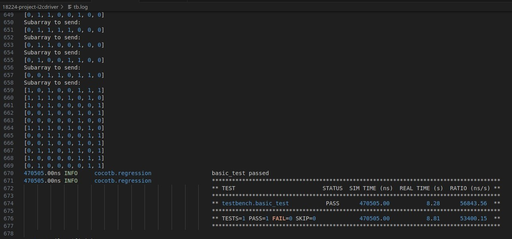

# I2C Translator

Jeffery Cao

18-224 Spring 2024 Final Tapeout Project

<!-- (NOTE: Please follow the bracketed instructions to populate descriptions relevant to your project, and then remove the bracketed instructions before pushing this file to your repo) -->

## Overview

This is a I2C to byte converter which converts I2C message to a parallel 8-pin output and vice versa. Good for using with LCD display or other device that requires parallel data in. 

The Address of this device is `0x49`, fixed.
<!-- (high-level overview of what your project does, in a few lines) -->

## How it Works

The hardware for deciding I2C command is simple: A SIPO to collect bit into byte, A byte-register to store the data for slow peripheral to read in, a PISO to dump data from the peripheral to the I2C line. The hard part is the Controlling FSM, which controlls how SIPO and PISO behave in different situation, such as read or write. The design chosen is a supersampling approach, which the internal clock is much faster (as it should be), and samples the SCL/SDA bus. As such, a FSM that detect rising and falling of both SCL and SDA is needed. The reason that rising and fall for SDA is also needed is because the abnormal START/STOP condition of the I2C protocol, which can be shown below:

Since the timing between fall of SCL and SDA is unknown, both edge detecter is needed. Similarily, STOP condition is also recorded, 

One interesting property of I2C is that between the rising edge of SCL and the falling edge of the SCL, value is safe to take. For the design, that means for reading from master, we sample the clock right after SCL rise, and for writing, to avoid not make in-time with rise-clock write, we can write at fall-SCL to protect the integrity of data during SCL-high. 

The diagram above showed the data path (which is simple) and 4 little FSM for pattern detection. The diagram below shows the control FSM, a 13-state large FSM with some edit marks. Since the I2C write and read is with respect to the Master, I swapped the Read and Write in my FSM to be with respect to peripheral. 

The acknowledgement protocol happens when master releases the SDA line, which is at the time when SCL falls at the earliest. To avoid losing control to the wire (The SDA is a pulled up, which means if not claim quickly, the SDA will create a short pulse which Master cannot comprehend), Downpulling to acknowledge is started right after SCL falls for the last bit of the byte. From the state transition diagram, it is around the `READ_ACK`, `WRITE_ACK`, and `READ_LOAD` stage. For writes, since Master is acknowledging, the device will give up the control on the SDA wire as early as the last fall of the SCL, and then sample at the SCL rise to give full time for Master to acknowledge (remember, between rise and fall, SDA value is always legit). Master will mark stop reading from periphral with a NACK, which we will detect and return to idle stage. 

The to-peripheral side is a bit different, as the 8-bit port is for both in and out. The approach to gather data to master is a polling method, which as long as the PISO is empty, and the `data` is not shorted to the end of the register, then the piso will fetch the value and prepare to spit it out. Technically, the two signal logics `writeOK` and `data_in` is not needed, but for clearity , it is the there for customized firmware (like me when I test the chip) to take advantage of that two pin.

## Inputs/Outputs

In: (SCL, data_incoming, data_in[7:0], SDA_in) 
Out: (writeOK, data_out[7:0], SDA_out, wr_up, wr_down)

SCL: I2C clock signal. This device does not support clock stretching.
data_incoming: A switch signaling upstream byte is ready
data_in/out[7:0]: THe byte to send/receive
SDA_in: SDA line to the translator
writeOK: Signal line shows it is OK to put data on data_in
SDA_out: SDA line output from the translator
wr_up: Tri-state buffer control signal enabling bidirectional SDA
wr_down: Tri-state buffer control signal enabling pin sharing for data_in and data_out

<!-- (describe what each of the 12 input and 12 output pins are used for; )

(if you have any specific dependency on clock frequency; i.e. for visual effects or for an external interface, explain it here.) -->

## Hardware Peripherals

This is not a standalone device. To be fully functional, use tri-state driver or hardware multiplexer to link the SDA and SCL as previous diagram to enable real I2C communication. 

<!-- (if you have any external hardware peripherals such as buttons, LEDs, sensors, etc, please explain them here. otherwise, remove this section) -->

## Design Testing / Bringup

In terms of the testbench, it will be a COCOTB testbench for the logic checking inside the chip. run `make -Bf testbench.mk` to start run the cocotb testbench. A `PASS` should be outputted.

The GTKwave waforform looked roughly like this:

Both log and VCD file is in the `etc` folder. 

After the chip is manufactured, please test the chip based on the hardware schematic. A multiplexer or tri-state buffer will be needed to togger between SCL line to be either SCL_in or SCL_out. On the lower stream, either populate the input to master be either hand controlled or controller-controlled. Nontheless, the master need to be capable of sending I2C signals and receiving I2C signals. Note that this system does not support clock stretching, so the I2C clock should be uniform. 

On the master microcontroller, use `I2C.write` (if you are using micropython) or `Wire.write()` (if you are a Arduino lover) to test the input. The Address of this device is `0x49`, fixed. Hook up the `data_out` to LED, you should be able to see the LED change in respective of the data sent (The chip uses 3.3V logic). Similarily, test the upstream datapath using `I2C.read` or `Wire.read`.
<!-- (explain how to test your design; if relevant, give examples of inputs and expected outputs)

(if you would like your design to be tested after integration but before tapeout, provide a Python script that uses the Debug Interface posted on canvas and explain here how to run the testing script) -->

<!-- ## Media

(optionally include any photos or videos of your design in action)

## (anything else)

If there is anything else you would like to document about your project such as background information, design space exploration, future ideas, verification details, references, etc etc. please add it here. This template is meant to be a guideline, not an exact format that you're required to follow. -->
